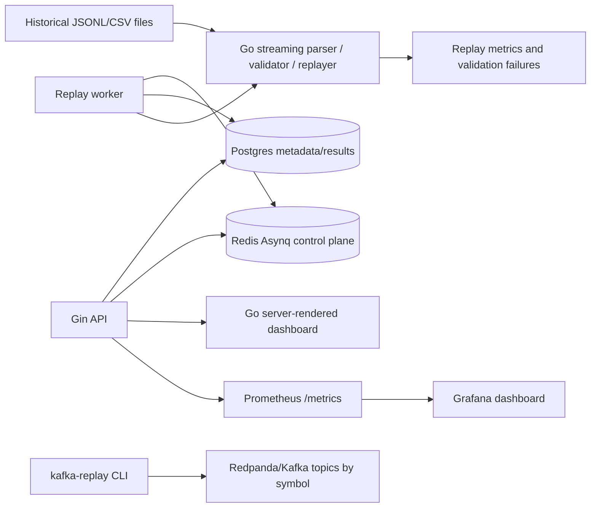

# Architecture

This document defines the current architecture for a pure Go Market Replay Service. The implementation keeps the Phase 0-1 replay core small, then layers API metadata, Redis control-plane jobs, Prometheus/Grafana observability, Kafka-compatible data-plane replay, and a minimal server-rendered dashboard around it.

The system is still bounded to historical market-data replay diagnostics and benchmark instrumentation. It is not a live trading system, not an automatic execution engine, and not a claim of production exchange connectivity.

## Goals

- Parse deterministic local market-data files with streaming readers.
- Normalize supported input rows into typed Go events.
- Replay events in source order with timestamp-derived speed control according to `ReplayJob` settings.
- Validate malformed rows, required fields, timestamp ordering, and depth update sequence continuity.
- Emit validation results and replay metrics suitable for local benchmarks and service observability.
- Persist dataset, event-file, job, validation-error, and metric metadata.
- Run asynchronous replay jobs through a Redis-backed control plane.
- Publish historical file replay into Kafka-compatible topics for data-plane validation.

## Non-Goals

- Live market-data ingestion.
- Trading, automatic execution, order routing, or trading recommendations.
- Production deployment, horizontal scaling, or exchange connectivity.

## System Model



| Layer | Responsibility |
| --- | --- |
| Replay core | Stream files, parse events, validate malformed rows and sequence gaps, replay with speed control, and report benchmark metrics. |
| HTTP API | Register datasets/event files, submit replay jobs, expose job state, metrics, validation errors, dashboard pages, pprof, and Prometheus metrics. |
| Postgres | Durable source of truth for metadata, job state, checkpoints, validation errors, and replay metrics. |
| Redis/Asynq | Control-plane queue for asynchronous replay jobs, retries, timeout, idempotent dispatch, and DLQ/archive behavior. |
| Kafka-compatible stream | Optional data-plane replay path that publishes historical events to symbol-keyed topics and consumes them for validation/error routing. |
| Observability | Prometheus metrics, Grafana dashboard provisioning, Zap structured logs, and pprof endpoints. |
| Dashboard | Small server-rendered HTML surface for interview/demo inspection; not a large frontend product. |

## Phase 1 Core Model

The replay core stays small and explicit:

| Component | Responsibility |
| --- | --- |
| Parser | Stream JSONL depth or CSV aggregate trade rows and produce typed events. |
| Validator | Check required fields, parse errors, timestamp monotonicity where configured, and depth sequence gaps. |
| Replayer | Consume parsed events and emit them according to replay speed settings. |
| Metrics Collector | Track throughput, latency, memory, allocation, malformed-row, and gap counters. |
| CLI | Wire local files to parser, validator, replayer, and benchmark output. |

All Phase 1 components can run in one Go process. Interfaces should be simple enough to test with `testdata/` fixtures.

## Data Flow

```text
local file -> streaming parser -> validator -> replay loop -> metrics/result output
```

The parser should preserve row-level errors as validation counters. It should not panic on malformed fixture rows.

## Event Contracts

### DepthEvent

JSONL input. One object per line.

```json
{
  "event_type": "depth",
  "symbol": "BTCUSDT",
  "event_time": 1710000000000,
  "first_update_id": 1001,
  "final_update_id": 1002,
  "bids": [["68250.10", "0.500"]],
  "asks": [["68251.00", "0.250"]]
}
```

Validation rules:

- `event_type` must equal `depth`.
- `symbol` must be non-empty.
- `event_time`, `first_update_id`, and `final_update_id` must be positive integers.
- `final_update_id` must be greater than or equal to `first_update_id`.
- `bids` and `asks` must be arrays of two-item string arrays.
- For each symbol, the next event's `first_update_id` should equal the previous event's `final_update_id + 1`.

### TradeEvent

CSV input with a header row.

```csv
event_type,symbol,trade_id,price,quantity,trade_time,is_buyer_maker
aggTrade,SOLUSDT,9001,148.1200,12.50,1710000001000,true
```

Validation rules:

- `event_type` must equal `aggTrade`.
- `symbol` must be non-empty.
- `trade_id` and `trade_time` must be positive integers.
- `price` and `quantity` must be valid positive decimal strings.
- `is_buyer_maker` must parse as a boolean.

### ReplayJob

In-memory job configuration used by CLI or tests.

```json
{
  "id": "phase1-smoke",
  "dataset_id": "fixture-btcusdt-depth",
  "symbol": "BTCUSDT",
  "file_path": "testdata/btcusdt_depth.jsonl",
  "speed": "max",
  "status": "pending",
  "submitted_at": "2026-05-20T00:00:00Z"
}
```

Fields:

- `id string`
- `dataset_id string`
- `symbol string`
- `file_path string`
- `speed string`
- `status string`
- `submitted_at time.Time`
- `started_at *time.Time`
- `completed_at *time.Time`

### ValidationResult

Validation output for parser and replay checks.

```json
{
  "rows": 4,
  "events": 4,
  "malformed_events": 0,
  "sequence_gaps": 0,
  "ordering_failures": 0,
  "symbol_event_counts": {
    "BTCUSDT": 4
  },
  "failures": []
}
```

Fields:

- `rows int64`
- `events int64`
- `malformed_events int64`
- `sequence_gaps int64`
- `ordering_failures int64`
- `symbol_event_counts map[string]int64`
- `failures []ValidationFailure`
- `started_at time.Time`
- `completed_at time.Time`

### ReplayMetric

Benchmark and replay measurement output.

```json
{
  "rows": 4,
  "events": 4,
  "malformed_events": 0,
  "sequence_gaps": 0,
  "duration": 250000,
  "rows_per_second": 16000,
  "events_per_second": 16000,
  "p95_latency": 10000,
  "peak_alloc_bytes": 1048576,
  "allocs_per_event": 2.0,
  "workload_file_path": "testdata/btcusdt_depth.jsonl"
}
```

Fields:

- `rows int64`
- `events int64`
- `malformed_events int64`
- `sequence_gaps int64`
- `duration time.Duration`
- `rows_per_second float64`
- `events_per_second float64`
- `p95_latency time.Duration`
- `peak_alloc_bytes uint64`
- `allocs_per_event float64`
- `processed_at time.Time`
- `workload_file_path string`

## Phase 1 Implementation Notes

- Prefer `bufio.Scanner` with an increased buffer or `bufio.Reader` for JSONL so larger rows do not fail unexpectedly.
- Use `encoding/json` and `encoding/csv` from the Go standard library for the first parser.
- Keep decimal values as strings in event structs unless arithmetic is required.
- Treat validation failures as data, not process crashes.
- Keep benchmark output deterministic enough for regression comparison, while accepting that absolute timings vary by machine.
